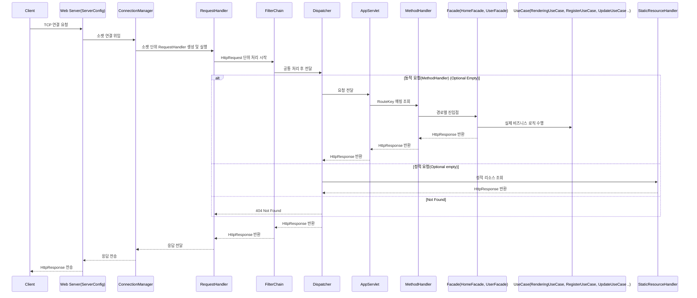
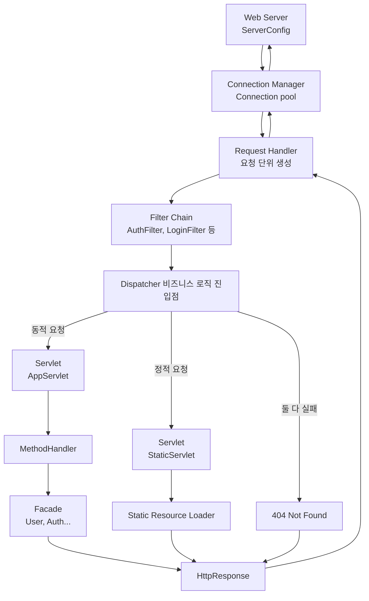

## 미니 WAS 만들기

### 톰캣과 스프링은 POJO일 뿐이야
스프링은 결국 자바이고 POJO라는 철학을 몸소 느꼈습니다. 
또, 구현 과정에서 매번 객체를 새로 만들다가 싱글톤 패턴으로 전환하고 간단한 DI 컨테이너를 만들면서 스프링이 IoC와 DI를 택한 이유를 이해할 수 있었습니다.

하지만!! 선조 개발자들 감사합니다
Spring 이라는 프레임워크로 웹백엔드 개발자가 얼마나 편해진 건지 Spring이 있는 시대에 백엔드 개발을 시작한 저에겐 가늠도 안됩니다..

### HTTP는 문자열일 뿐이야
또한 HTTP가 결국 문자열을 주고받는 규약이라는 점, 톰캣과 스프링이 이를 해석하고 보완해 온 과정을 탐구하며 선배 개발자들의 의도를 읽을 수 있었습니다.
하지만 이 규약으로 전세계 개발자들이 소통할 수 있게 한 점은 획기적인 아이디어라 생각합니다. 

### 나만의 WAS 만들기 — 아키텍처와 설계 의도

요약
- 이 프로젝트는 학습용으로 구현한 경량 WAS(웹 어플리케이션 서버)이다.
- 목표는 HTTP 연결 관리, 요청 파이프라인(필터 → 디스패처 → 서블릿), 라우팅/메서드 핸들링, 정적 자원 제공, 최소한의 DI/구성 관리를 통해 실제 WAS 설계 원칙을 체득하는 것이다.

구성 요소 개요
- `ServerConfig`
    - 서버 전체 설정과 생명주기 관리(포트, 쓰레드풀 크기 등).
    - 전역 설정(singleton 성격)으로 구성하여 구성 일관성을 보장.

- `ConnectionManager`
    - 소켓 수명 관리와 커넥션 풀, Keep-Alive 지원.
    - 목적: 소켓 재사용으로 비용 절감 및 지속 연결(HTTP Keep-Alive) 처리.
    - 관련 고려사항: 버퍼드 리더/라이터를 닫는 시점이 소켓에 영향을 미치는 문제를 명시적으로 처리.

- `RequestHandler`
    - 소켓 단위로 들어온 연결을 HTTP 요청 단위로 파싱하고 응답 반환.
    - 쓰레드풀로 실행되어 동시성 제어 수행.

- `FilterChain`
    - 인증/로그인/공통 처리 필터를 체인 형태로 구성.
    - 패턴: Chain of Responsibility
    - 의도: 각 필터가 관심사를 분리해 재사용·조합 가능하게 함.

- `Dispatcher` / `AppServlet`
    - 모든 동적 요청의 진입점 (Front Controller 역할).
    - 라우팅 후 `MethodHandler`를 호출해 실제 비즈니스 진입.
    - 패턴: Front Controller + Dispatcher

- `MethodHandler` / 라우터
    - HTTP 메서드 및 경로 매핑을 담당.
    - 패턴: Strategy / Command — 경로별(또는 메서드별) 핸들러 전략을 분리해 확장성 제공.
    - 의도: 새로운 엔드포인트 추가 시 라우팅 테이블만 갱신하면 됨.

- `Facade` (예: `HomeFacade`, `UserFacade`)
    - 비즈니스 UseCase 집합에 대한 단일 진입점 제공.
    - 패턴: Facade
    - 의도: 컨트롤러(핸들러)와 도메인 로직 간 결합을 낮추고, UseCase 호출을 단순화.

- `UseCase` 계층
    - 실제 비즈니스 로직(예: RenderingUseCase, RegisterUseCase 등).
    - 의도: 단일 책임 원칙, 테스트 가능성 향상.

- `StaticResourceHandler`
    - 정적 파일 제공(정적 요청과 동적 요청을 분리).
    - 목적: 캐싱/콘텐츠 타입 처리 등 별도 최적화 가능.

핵심 디자인 패턴 및 설계 결정 이유
- Chain of Responsibility (FilterChain)
    - 요청 전/후 처리를 필터 단위로 분리하여 재사용성과 조합성을 높임.

- Front Controller / Dispatcher
    - 모든 요청을 중앙에서 제어해 공통 로직(인증, 로깅, 예외 처리 등)을 집중적으로 처리.

- Strategy / Command (MethodHandler / Routing)
    - 엔드포인트별 행동을 분리해 확장성과 테스트 용이성을 확보.

- Facade + UseCase
    - 컨트롤러와 도메인 사이의 경계를 명확히 하여 복잡도 완화.

- Connection Pool / Thread Pool
    - 네트워크·I/O 비용을 고려한 리소스 관리. 적정 쓰레드 수 결정은 실제 블로그 글의 계산 근거를 따름.

운영/성능 고려사항
- Keep-Alive 전략
    - 요청 처리 후 연결을 바로 닫지 않고 재사용하도록 관리 — throughput 향상.
    - 다만 idle connection 관리를 위한 타임아웃, 최대 재사용 횟수 제어 필요.

- BufferedReader/Stream 관리
    - 스트림을 닫으면 소켓도 닫히는 언어/라이브러리 특성 이해 필요.
    - 리소스는 try-with-resources 또는 명시적 플래그로 안전하게 관리.

- 쓰레드 수 튜닝
    - CPU-bound vs I/O-bound 성격에 따라 계산법이 다름(프로젝트 문서의 링크 참조).
    - 기본은 적정 수의 워커 쓰레드 + 큐로 백프레셔 처리.

확장성 / 유지보수
- 새로운 필터 추가는 `FilterChain`에 등록하면 됨(비침투적 변경).
- 새로운 라우트는 `MethodHandler` 매핑에 등록 — 런타임 라우팅 또는 시작 시 설정으로 확장 가능.
- DIContainer는 최소한의 의존성 주입만 구현(학습 목적). 실제 운영에서는 검증된 DI 프레임워크 권장.

오류 처리 및 응답 정책
- Not Found(404) 처리: Dispatcher에서 동적·정적 모두 실패 시 일관된 404 응답 반환.
- 예외 처리: 필터/Dispatcher 레벨에서 Catch 후 5xx 응답으로 변환해 클라이언트에 노출.

테스트 및 검증 포인트
- 커넥션 재사용(Keep-Alive) 케이스 자동화 테스트.
- 동시성(동시 연결/요청) 부하 테스트로 쓰레드풀 설정 검증.
- 라우팅·권한 필터 조합에 대한 단위 테스트(각 필터를 독립적으로 검증).

참고 및 설계 근거
- 톰캣을 학습 대상으로 선택한 이유: 실제 서버 구조와 운영 고려사항을 이해하기 위함(설명 링크 포함).
- 프로젝트 내 블로그 글들:
    - 적정 쓰레드 수 계산, BufferedReader와 소켓 관계, Keep-Alive 관리법, 억지 DI 적용 회고 등은 구현·정책 결정의 근거 자료로 활용됨.

마지막으로
- 이 WAS는 학습용으로 설계되었으며, 성능·보안·운영성이 중요한 프로덕션 환경에는 추가 검증과 보완이 필요하다.
- 설계 의도는 명확한 책임 분리(Separation of Concerns), 확장성(Strategy/Facade), 재사용성(Chain)과 안정적인 리소스 관리(Connection/Thread Pool)에 있다.
### 설계 다이어그램

### 구현기
1. [왜 톰캣인가?](https://velog.io/@genius00hwan/%EC%99%9C-%ED%86%B0%EC%BA%A3%EC%9D%B8%EA%B0%80)
2. [적정한 쓰레드 수를 찾아보자](https://velog.io/@genius00hwan/%EC%A0%81%EC%A0%95%ED%95%9C-%EC%93%B0%EB%A0%88%EB%93%9C-%EC%88%98%EB%A5%BC-%EC%B0%BE%EC%95%84%EB%B3%B4%EC%9E%90)
3. [BufferedReader를 닫으면 왜 소켓도 닫힐까?](https://velog.io/@genius00hwan/BufferedReader%EB%A5%BC-%EB%8B%AB%EC%9C%BC%EB%A9%B4-%EC%99%9C-%EC%86%8C%EC%BC%93%EB%8F%84-%EB%8B%AB%ED%9E%90%EA%B9%8C)
4. [Keep-Alive 를 위한 커넥션 관리 방법](https://velog.io/@genius00hwan/Keep-Alive-%EB%A5%BC-%EC%9C%84%ED%95%9C-%EC%BB%A4%EB%84%A5%EC%85%98-%EA%B4%80%EB%A6%AC-%EB%B0%A9%EB%B2%95)
5. [요청에 맞는 소켓을 재사용할 수 있는 이유](https://velog.io/@genius00hwan/%EC%9A%94%EC%B2%AD%EC%97%90-%EB%A7%9E%EB%8A%94-%EC%86%8C%EC%BC%93%EC%9D%84-%EC%9E%AC%EC%82%AC%EC%9A%A9%ED%95%A0-%EC%88%98-%EC%9E%88%EB%8A%94-%EC%9D%B4%EC%9C%A0)
6. [WAS에 억지 DI 시켜보기](https://velog.io/@genius00hwan/WAS%EC%97%90-%EC%96%B5%EC%A7%80-DI-%EC%8B%9C%EC%BC%9C%EB%B3%B4%EA%B8%B0)
7. [전략패턴기반 API 분기 설계](https://velog.io/@genius00hwan/%EC%A0%84%EB%9E%B5%ED%8C%A8%ED%84%B4%EA%B8%B0%EB%B0%98-API-%EB%B6%84%EA%B8%B0-%EC%84%A4%EA%B3%84)
8. [라우팅과 메서드 핸들러 설계](https://velog.io/@genius00hwan/%EB%9D%BC%EC%9A%B0%ED%8C%85%EA%B3%BC-%EB%A9%94%EC%84%9C%EB%93%9C-%ED%95%B8%EB%93%A4%EB%9F%AC-%EC%84%A4%EA%B3%84)
9. [Spring이 강한 제약을 두는 이유](https://velog.io/@genius00hwan/Spring%EC%9D%B4-%EA%B0%95%ED%95%9C-%EC%A0%9C%EC%95%BD%EC%9D%84-%EB%91%90%EB%8A%94-%EC%9D%B4%EC%9C%A0)
10. [쿠키 Max-Age 음수값에 대한 의문과 정리](https://velog.io/@genius00hwan/%EC%BF%A0%ED%82%A4-Max-Age-%EC%9D%8C%EC%88%98%EA%B0%92%EC%97%90-%EB%8C%80%ED%95%9C-%EC%9D%98%EB%AC%B8%EA%B3%BC-%EC%A0%95%EB%A6%AC)
11. [DIContainer 개선 회고](https://velog.io/@genius00hwan/DIContainer-%EA%B0%9C%EC%84%A0-%ED%9A%8C%EA%B3%A0)
