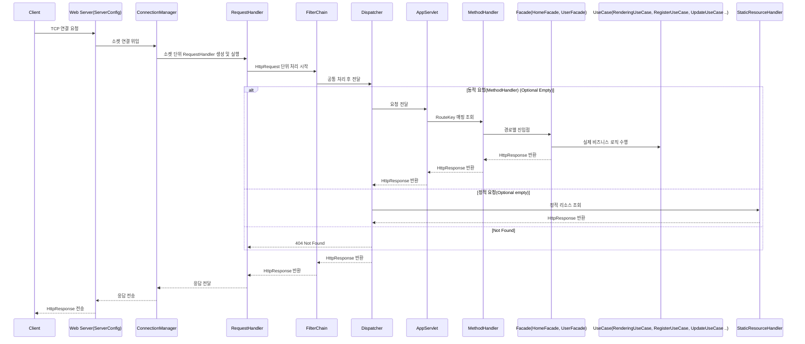
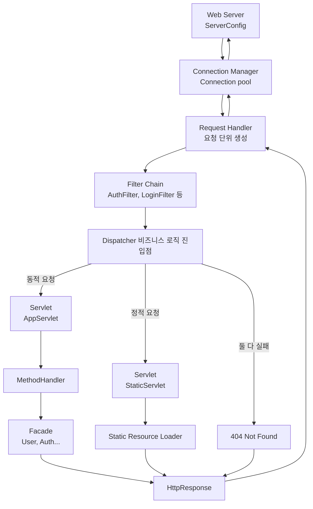

# 나만의 WAS 만들기 프로젝트
## 설계 다이어그램

### 구현기
1. [왜 톰캣인가?](https://velog.io/@genius00hwan/%EC%99%9C-%ED%86%B0%EC%BA%A3%EC%9D%B8%EA%B0%80)
2. [적정한 쓰레드 수를 찾아보자](https://velog.io/@genius00hwan/%EC%A0%81%EC%A0%95%ED%95%9C-%EC%93%B0%EB%A0%88%EB%93%9C-%EC%88%98%EB%A5%BC-%EC%B0%BE%EC%95%84%EB%B3%B4%EC%9E%90)
3. [BufferedReader를 닫으면 왜 소켓도 닫힐까?](https://velog.io/@genius00hwan/BufferedReader%EB%A5%BC-%EB%8B%AB%EC%9C%BC%EB%A9%B4-%EC%99%9C-%EC%86%8C%EC%BC%93%EB%8F%84-%EB%8B%AB%ED%9E%90%EA%B9%8C)
4. [Keep-Alive 를 위한 커넥션 관리 방법](https://velog.io/@genius00hwan/Keep-Alive-%EB%A5%BC-%EC%9C%84%ED%95%9C-%EC%BB%A4%EB%84%A5%EC%85%98-%EA%B4%80%EB%A6%AC-%EB%B0%A9%EB%B2%95)
5. [요청에 맞는 소켓을 재사용할 수 있는 이유](https://velog.io/@genius00hwan/%EC%9A%94%EC%B2%AD%EC%97%90-%EB%A7%9E%EB%8A%94-%EC%86%8C%EC%BC%93%EC%9D%84-%EC%9E%AC%EC%82%AC%EC%9A%A9%ED%95%A0-%EC%88%98-%EC%9E%88%EB%8A%94-%EC%9D%B4%EC%9C%A0)
6. [WAS에 억지 DI 시켜보기](https://velog.io/@genius00hwan/WAS%EC%97%90-%EC%96%B5%EC%A7%80-DI-%EC%8B%9C%EC%BC%9C%EB%B3%B4%EA%B8%B0)
7. [전략패턴기반 API 분기 설계](https://velog.io/@genius00hwan/%EC%A0%84%EB%9E%B5%ED%8C%A8%ED%84%B4%EA%B8%B0%EB%B0%98-API-%EB%B6%84%EA%B8%B0-%EC%84%A4%EA%B3%84)
8. [라우팅과 메서드 핸들러 설계](https://velog.io/@genius00hwan/%EB%9D%BC%EC%9A%B0%ED%8C%85%EA%B3%BC-%EB%A9%94%EC%84%9C%EB%93%9C-%ED%95%B8%EB%93%A4%EB%9F%AC-%EC%84%A4%EA%B3%84)
9. [Spring이 강한 제약을 두는 이유](https://velog.io/@genius00hwan/Spring%EC%9D%B4-%EA%B0%95%ED%95%9C-%EC%A0%9C%EC%95%BD%EC%9D%84-%EB%91%90%EB%8A%94-%EC%9D%B4%EC%9C%A0)
10. [쿠키 Max-Age 음수값에 대한 의문과 정리](https://velog.io/@genius00hwan/%EC%BF%A0%ED%82%A4-Max-Age-%EC%9D%8C%EC%88%98%EA%B0%92%EC%97%90-%EB%8C%80%ED%95%9C-%EC%9D%98%EB%AC%B8%EA%B3%BC-%EC%A0%95%EB%A6%AC)
11. [DIContainer 개선 회고](https://velog.io/@genius00hwan/DIContainer-%EA%B0%9C%EC%84%A0-%ED%9A%8C%EA%B3%A0)